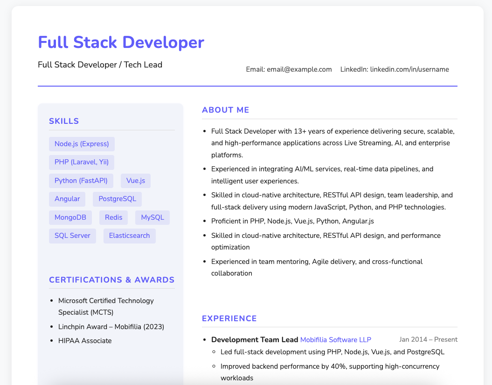
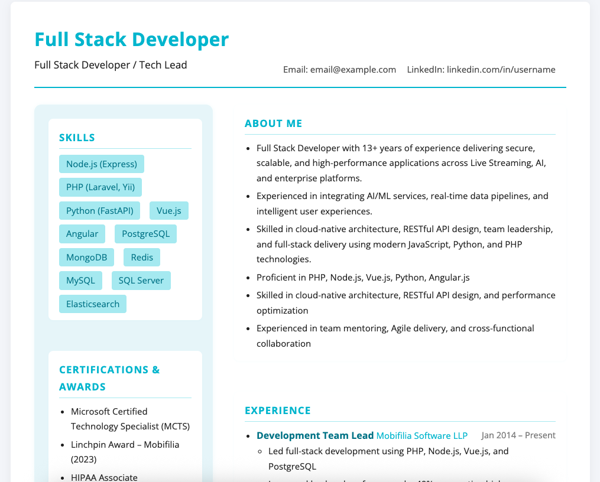
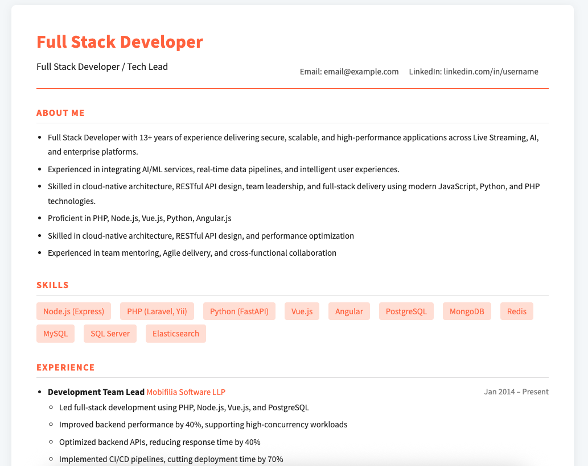
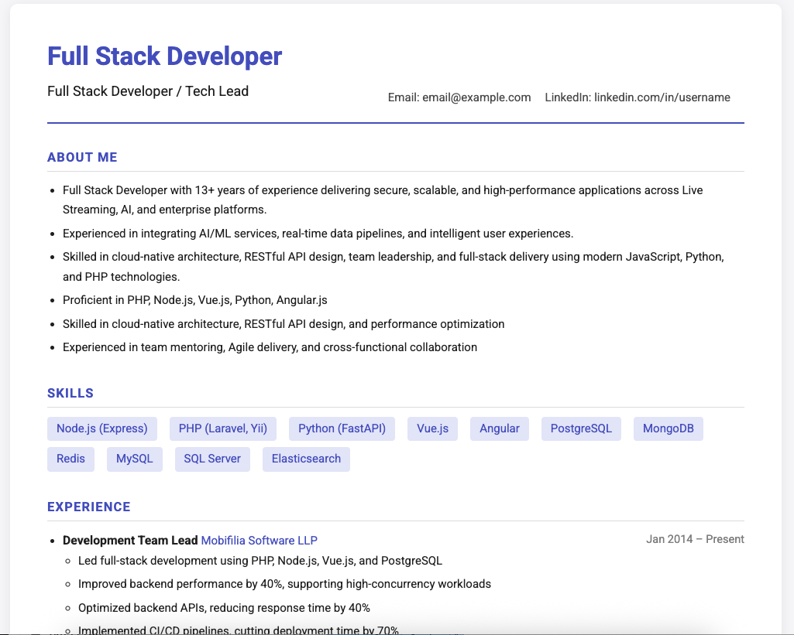
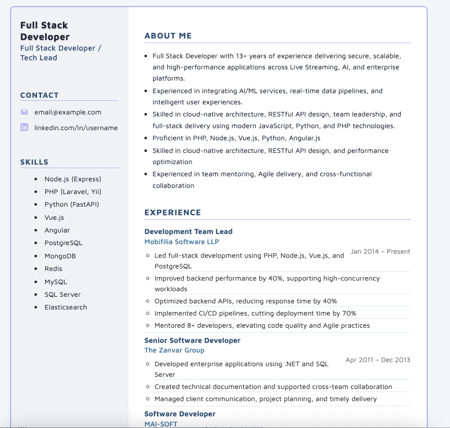
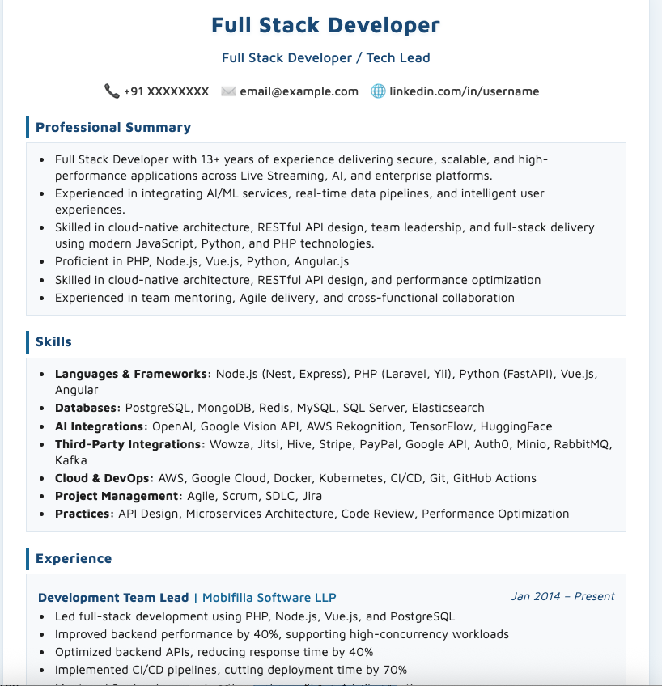

# Resume HTML Generator

This project demonstrates how to generate a resume web page from a single JSON data source, allowing you to maintain your resume content in one place and render it in multiple HTML formats.

## Features
- **Single Source of Truth:** All resume data is stored in `resume.json`.
- **Dynamic Rendering:** The HTML (`resume.html`) uses JavaScript to load and render the resume from the JSON file.
- **Modern Design:** Uses Google Fonts and responsive CSS for a professional look.
- **Easy to Update:** Update your resume by editing only the JSON file.

## How to Use

### 1. Start a Local Server
Due to browser security restrictions, you must use a local server to view the resume. In your terminal, run:

```
cd /Users/vishalwayachal/Documents/MOBIFILIA/github_vishal/resumeHtml
python3 -m http.server 8000
```

Then open your browser and go to:

```
http://localhost:8000/resume.html
```

### 2. Edit Your Resume
- Update `resume.json` with your latest information.
- The HTML will automatically reflect your changes when you refresh the page.

### 3. Customization
- You can create additional HTML templates that use the same JSON data for different resume formats.
- All styling is in the `<style>` section of `resume.html`.

## Files
- `resume.html` — Main HTML file that loads and renders the resume.
- `resume.json` — All resume data in JSON format.
- `README.md` — This file.


## Preview







## Troubleshooting
- If you see a blank page, make sure you are running a local server (see step 1 above).
- The fetch API does not work with `file://` URLs due to browser security.

## License
MIT
